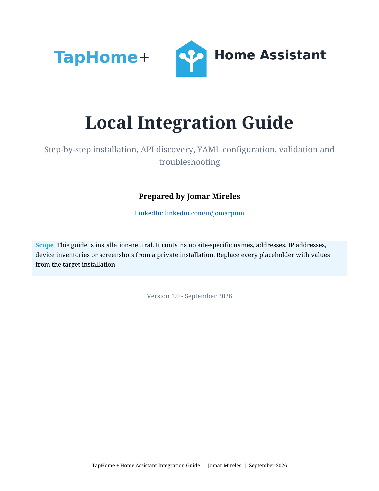
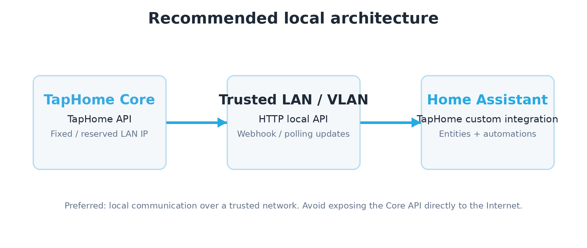
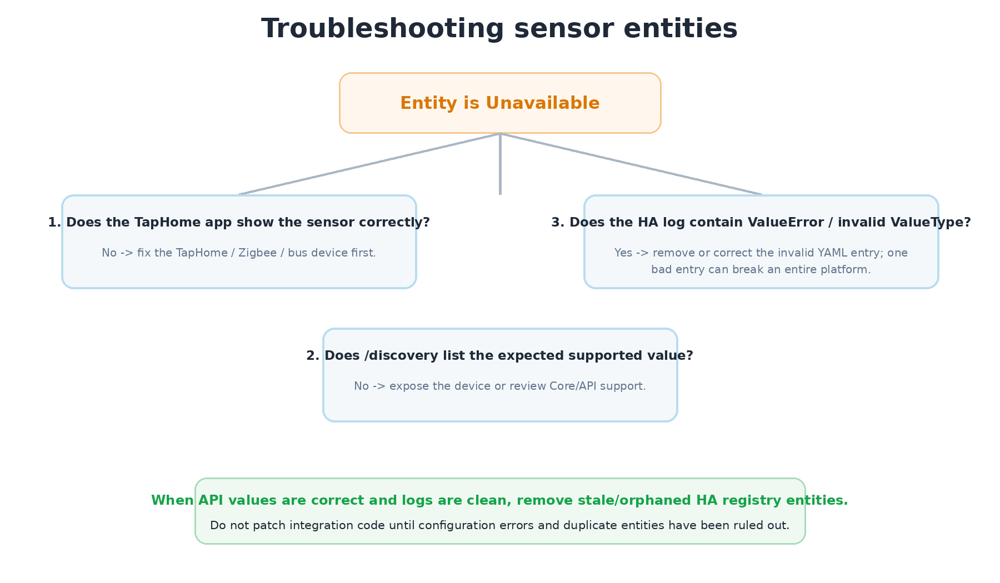

<p align="center">
  
</p>

# TapHome + Home Assistant Integration Guide

A practical, vendor-neutral guide for integrating **TapHome** with **Home Assistant** using the TapHome API and the community-maintained [`martindybal/taphome-homeassistant`](https://github.com/martindybal/taphome-homeassistant) integration.

This repository focuses on repeatable installation, API discovery, device inventory, YAML configuration, validation, troubleshooting, and safe handover to a third party.

> **Independent project.** This repository is not an official TapHome or Home Assistant project and is not affiliated with, endorsed by, or sponsored by either brand.

## Download the guide

**[TapHome + Home Assistant Integration Guide - PDF](docs/TapHome_Home_Assistant_Integration_Guide_EN.pdf)**  
Editable source: [`docs/source/TapHome_Home_Assistant_Integration_Guide_EN.docx`](docs/source/TapHome_Home_Assistant_Integration_Guide_EN.docx)

<p align="center">
  <a href="docs/TapHome_Home_Assistant_Integration_Guide_EN.pdf">
    
  </a>
</p>

## What this repository contains

- Step-by-step TapHome API setup and token handling.
- Local API access through the TapHome Core.
- Device discovery and inventory generation.
- Home Assistant / HACS installation workflow.
- Generic `configuration.yaml` and `secrets.yaml` examples.
- API probe and inventory scripts.
- Troubleshooting for unavailable entities, unsupported `ValueType` entries, duplicates, and stale entity-registry entries.
- Deployment checklist for installing the same solution for another site.

## Recommended architecture

<p align="center">
  
</p>

For normal operation, prefer the **local TapHome API** over the public cloud endpoint whenever the Home Assistant host can reach the TapHome Core over LAN or VPN. TapHome documents local API support for compatible Core versions, while the community integration is designed for local operation and immediate updates through the TapHome webhook.

## 1. TapHome API preparation

In the TapHome application:

1. Open **Settings**.
2. Open **Expose devices**.
3. Select **TapHome API**.
4. Expose only the devices that the external integration needs.
5. Use the context menu (**three dots**) to generate a fresh access token.
6. Store that token securely. Do not commit it to GitHub.

TapHome's official documentation describes the API as HTTP/JSON and provides both the public API endpoint and local network access. The public base URL is:

```text
https://api.taphome.com/api/TapHomeApi/v1/
```

For a local Core, use:

```text
http://<CORE_IP>/api/cloudapi/v1
```

Authentication uses this header:

```http
Authorization: TapHome <TOKEN>
```

## 2. Test the API before Home Assistant

Set temporary shell variables:

```bash
export TAPHOME_API_URL="http://192.168.1.50/api/cloudapi/v1"
export TAPHOME_TOKEN="replace-with-your-token"
```

Test discovery:

```bash
curl -s \
  -H "Authorization: TapHome $TAPHOME_TOKEN" \
  "$TAPHOME_API_URL/discovery" | python3 -m json.tool
```

Read all current values:

```bash
curl -s \
  -H "Authorization: TapHome $TAPHOME_TOKEN" \
  "$TAPHOME_API_URL/getAllDevicesValues" | python3 -m json.tool
```

Read one device by ID:

```bash
DEVICE_ID=44
curl -s \
  -H "Authorization: TapHome $TAPHOME_TOKEN" \
  "$TAPHOME_API_URL/getDeviceValue/$DEVICE_ID" | python3 -m json.tool
```

The `discovery` endpoint is the main source for identifying exposed devices and their supported value types.

## 3. Generate a device inventory

Use the included Python tool. It uses only the Python standard library:

```bash
export TAPHOME_API_URL="http://192.168.1.50/api/cloudapi/v1"
export TAPHOME_TOKEN="replace-with-your-token"
python3 scripts/taphome_inventory.py --out-dir inventory
```

It creates:

```text
inventory/discovery.json
inventory/all_values.json
inventory/devices.csv
```

The CSV is intended as a working installation inventory. Keep the raw JSON files as the authoritative API snapshot.

You can also use the shell probe:

```bash
export TAPHOME_API_URL="http://192.168.1.50/api/cloudapi/v1"
export TAPHOME_TOKEN="replace-with-your-token"
./scripts/taphome_api_probe.sh
```

## 4. Install the Home Assistant integration

This guide **does not repackage or fork the integration**. Use the maintained upstream project:

**[`martindybal/taphome-homeassistant`](https://github.com/martindybal/taphome-homeassistant)**

The upstream project recommends installation through **HACS**. Search for **TapHome**, install it, and restart Home Assistant when required.

Supported platforms currently listed by the upstream project include binary sensors, buttons, climate, covers, events, fans, humidifiers, lights, selects, sensors, switches, time, and valves.

## 5. Store the token in `secrets.yaml`

Example:

```yaml
taphome_token: "PASTE_TOKEN_HERE"
```

Never publish a real token. The example file in this repository contains placeholders only.

## 6. Configure TapHome in `configuration.yaml`

Start from [`examples/configuration.yaml`](examples/configuration.yaml) and replace the example device IDs with IDs returned by your own `/discovery` response.

Minimal structure:

```yaml
taphome:
  cores:
    - id: home
      token: !secret taphome_token
      api_url: http://192.168.1.50/api/cloudapi/v1
      webhook_id: taphome_home

      sensors:
        - 101

      binary_sensors:
        - id: 102
          device_class: door

      lights:
        - 201

      covers:
        - id: 301
          device_class: blind
```

The example IDs above are fictional.

## 7. Validate before restarting

For Home Assistant Container:

```bash
docker exec homeassistant python -m homeassistant --script check_config --config /config
```

Then restart only if validation succeeds:

```bash
docker restart homeassistant
```

For Home Assistant OS / Supervised, use the built-in configuration check and restart controls available in the Home Assistant UI.

## Important troubleshooting lesson: one invalid entity can affect a whole platform

A configuration entry that uses a `value_type` unsupported by the installed integration can prevent the entire TapHome `sensor` or `binary_sensor` platform from loading.

Typical log pattern:

```text
ValueError: '<VALUE>' is not a valid ValueType
Error while setting up taphome platform for sensor
```

If lights and covers work but many sensors are unavailable:

1. Check the Home Assistant log for `taphome`, `ValueError`, and `Error while setting up`.
2. Temporarily comment out the invalid entity entry.
3. Validate the configuration.
4. Restart Home Assistant.
5. Confirm that the remaining sensor platform loads.
6. Verify questionable value types against the current upstream integration source before adding them back.

Do not assume that every value name returned by a TapHome device can be entered as a text `value_type` in YAML. The installed integration version is authoritative for accepted values.

<p align="center">
  
</p>

## Duplicate and stale entities

During testing, Home Assistant can retain registry entries from previous configurations. If the current entity works but an older entity with the same name remains `unavailable`, compare entity IDs and remove only the stale registry entry.

Also check the log for duplicate unique IDs:

```text
ID ... is already used by ... - ignoring ...
```

A duplicated explicit `value_type` can sometimes create the same logical entity twice. Prefer automatic detection when the upstream integration already supports the device type.

## Repository layout

```text
taphome-home-assistant-guide/
├── .github/
│   ├── ISSUE_TEMPLATE/
│   └── workflows/
├── assets/
├── docs/
│   ├── TapHome_Home_Assistant_Integration_Guide_EN.pdf
│   └── source/
│       └── TapHome_Home_Assistant_Integration_Guide_EN.docx
├── examples/
│   ├── configuration.yaml
│   └── secrets.yaml.example
├── scripts/
│   ├── taphome_api_probe.sh
│   └── taphome_inventory.py
├── CHANGELOG.md
├── CITATION.cff
├── CONTRIBUTING.md
├── LICENSE.md
├── README.md
├── SECURITY.md
└── TRADEMARKS.md
```

## Primary sources

- [TapHome API documentation](https://taphome.com/en/docs/expose-devices/taphome-api/)
- [TapHome API Swagger](https://api.taphome.com/api/doc)
- [Community TapHome integration for Home Assistant](https://github.com/martindybal/taphome-homeassistant)
- [Home Assistant installation documentation](https://www.home-assistant.io/installation/)
- [Home Assistant design / brand guidance](https://design.home-assistant.io/)

## Author

**Jomar Mireles**  
GitHub: [@Jomarmatos](https://github.com/Jomarmatos)  
LinkedIn: [linkedin.com/in/jomarjmm](https://pt.linkedin.com/in/jomarjmm)

## Licensing and trademarks

Original repository documentation is intended to be shared under **CC BY 4.0** and original scripts under the **MIT License**. See [`LICENSE.md`](LICENSE.md).

TapHome and Home Assistant names, logos, and marks belong to their respective owners and are excluded from the repository's open licenses. See [`TRADEMARKS.md`](TRADEMARKS.md).
